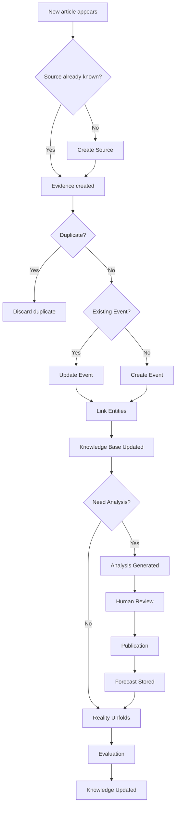

# Nexus-Think-Tank
-------------------------------------------------------------------------------------------------------------------------------------------------------------------
#  SECTION 1: VISION AND INFORMATION FLOW
-------------------------------------------------------------------------------------------------------------------------------------------------------------------

This project aims to develop a semi-automated self-improving system that provides financial, political, military, governance, and technology analyses and forecasts (posts). Relevant data will be extracted and saved in the database in a structured format. Specialized agents will subsequently use the data to provide posts. Each post will be saved in the database with a dedicated identifier. New evidence (data) will validate the previous posts, and their status will be updated, turning them into knowledge. The knowledge will be used to improve the performance of various agents.

Reality

↓

Evidence

↓

Structured Events

↓

Knowledge Base

↓

Specialized Agents

↓

Competing Claims

↓

Human Review

↓

Published Analysis

↓

Reality unfolds

↓

Evaluation

↓

Knowledge Base updated

-------------------------------------------------------------------------------------------------------------------------------------------------------------------
SECTION 2: DESIGN REQUIREMENTS
-------------------------------------------------------------------------------------------------------------------------------------------------------------------

| ID  | Requirement                                             | Why it matters                                |
| --- | ------------------------------------------------------- | --------------------------------------------- |
| R1  | Continuously collect information from diverse sources   | Avoid manual monitoring                       |
| R2  | Preserve raw evidence permanently                       | Ensure traceability                           |
| R3  | Convert unstructured information into structured events | Enable reasoning                              |
| R4  | Build cumulative organizational knowledge               | Prevent "starting from zero" every day        |
| R5  | Support specialized analytical perspectives             | Different domains require different expertise |
| R6  | Separate evidence, claims, and knowledge                | Avoid confusing facts with interpretations    |
| R7  | Evaluate forecasts against reality                      | Enable learning                               |
| R8  | Keep humans responsible for publication                 | Maintain accountability                       |
| R9  | Make every module replaceable                           | Technology changes rapidly                    |
| R10 | Minimize daily human effort                             | Respect your 30–60 minute time budget         |

-------------------------------------------------------------------------------------------------------------------------------------------------------------------
#  SECTION 3: INFORMATION MODEL
-------------------------------------------------------------------------------------------------------------------------------------------------------------------

##  3.1 CORE OBJECTS

###  3.1.1 Source

A Source describes where information originates, not what happened.
Examples: Reuters, ISNA, Central Bank of Iran, Parliament website, Telegram channel, X account, Government report, Academic paper
The Source says nothing about the event itself.

Responsibilities

A Source should answer:

Where did this information come from?
How trustworthy is it?
What type of source is it?
How frequently should it be checked?

**Attributes**

- Source

- ID

- Name

- Type(news agency, government, social media, database, research)

- Language

- Country

- URL

- Reliability score

- Political affiliation (optional)

- Collection method (RSS, API, scraping)

- Update frequency

- Status (active/inactive)

###  3.1.2 Evidence

Evidence represents a single observed piece of information exactly as obtained from a source.

Example

Reuters reports:

Iran announced the commissioning of two new gas processing facilities.

That article becomes one or more Evidence objects.

Responsibilities

Evidence should answer:

What exactly was observed?
Who reported it?
When?
How confident are we that the source reported this?

**Attributes**

- Evidence

- ID

- Source

- Collection time

- Publication time

- Original title

- Original text

- Original URL

- Language

- Media type

- Confidence

- Hash

- Processing status

###  3.1.3 Event

Multiple Evidence objects can describe one Event.

Purpose

Represent one occurrence in reality.

Example

Parliament approved
the 2027 budget.

That is one Event.

Ten newspapers may describe it differently.

Still one Event.

Responsibilities

An Event should answer

What happened?
Where?
When?
Who was involved?

**Attributes**

- Event

- ID

- Title

- Summary

- Start time

- End time

- Location

- Importance

- Confidence

- Evidence IDs

- Entity IDs

- Category

- Status

###  3.1.4 Entity

Entities are stable things.

Examples

People

Organizations

Companies

**Attributes**

- Entity

- ID

- Name

- Type

- Aliases

- Description

- Relationships

- Importance

- Confidence

###  3.1.5 Analysis Record

An Analysis Record should never overwrite reality.

Instead it represents

"At this moment,
given this evidence,
this analyst believes..."

**Attributes**

- Analysis Record

- ID

- Question

- Author (agent or human)

- Date

- Evidence used

- Assumptions

- Reasoning chain

- Claims

- Alternative hypotheses

- Confidence

- Forecast IDs

###  3.1.6 Forecast

A Forecast should answer

What?

Probability?

Time horizon?

Conditions?

Confidence?

Evaluation status?

Example

Probability

70%

Prediction

Fuel prices increase

Deadline

3 months

###  3.1.7 Knowledge

Knowledge should instead represent validated relationships about how the system believes the world works.

For example:
Economic sanctions

↓

usually reduce

↓

construction imports

Or

Currency depreciation

↓

often precedes

↓

construction inflation

Knowledge is not

"Sanctions happened."

Knowledge is

"Historically, sanctions tend to produce X under conditions Y."

**Attributes**

- Knowledge

- ID

- Statement

- Supporting analyses

- Supporting forecasts

- Supporting events

- Supporting evidence

- Confidence

- Last updated

- Contradicting evidence

- Status

##  3.2 OBJECT LIFECYCLE

##  3.3 Decision Gates

-------------------------------------------------------------------------------------------------------------------------------------------------------------------
SECTION 4: AGENT TAXONOMY AND REPOSITORIES
-------------------------------------------------------------------------------------------------------------------------------------------------------------------

-------------------------------------------------------------------------------------------------------------------------------------------------------------------
SECTION 5: TECHNOLOGY MAPPING
-------------------------------------------------------------------------------------------------------------------------------------------------------------------

