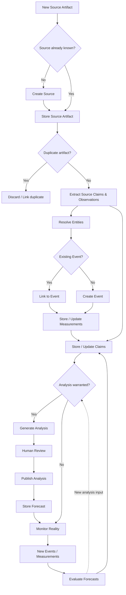
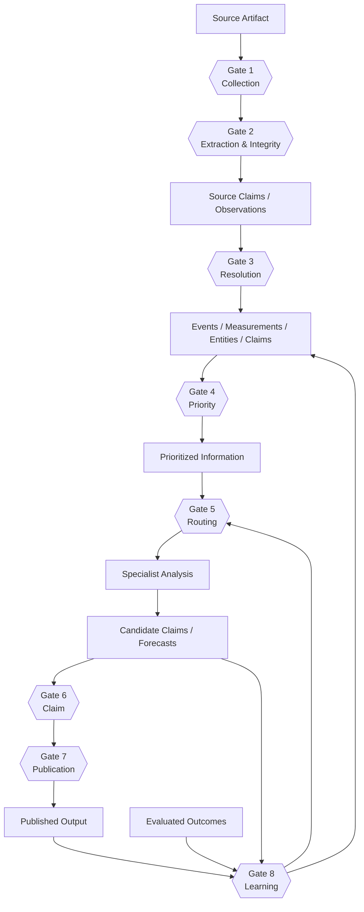
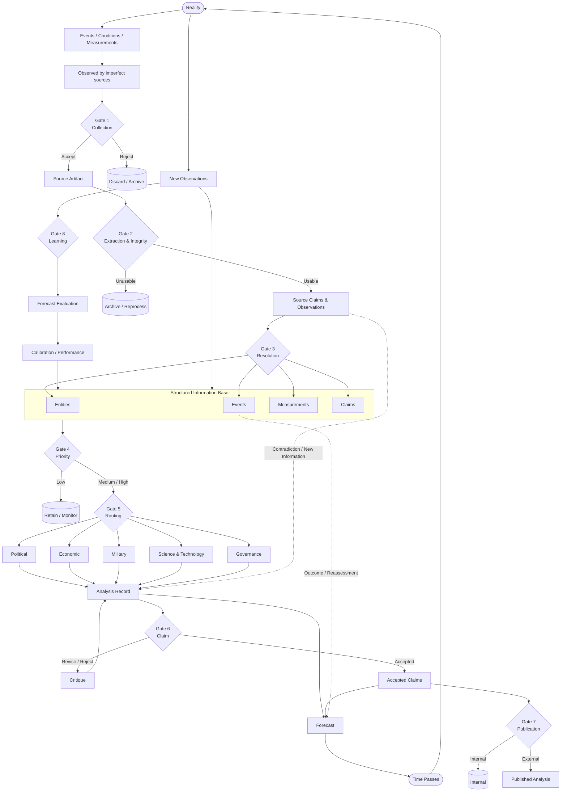

# Nexus-Think-Tank
-------------------------------------------------------------------------------------------------------------------------------------------------------------------
#  SECTION 1: VISION AND INFORMATION FLOW
-------------------------------------------------------------------------------------------------------------------------------------------------------------------

This project aims to develop a semi-automated self-improving system that provides financial, political, military, governance, and technology analyses and forecasts (posts). Relevant data will be extracted and saved in the database in a structured format. Specialized agents will subsequently use the data to provide posts. Each post will be saved in the database with a dedicated identifier. New evidence (data) will validate the previous posts, and their status will be updated, turning them into knowledge. The knowledge will be used to improve the performance of various agents.

Reality

↓

Evidence

↓

Structured Events

↓

Knowledge Base

↓

Specialized Agents

↓

Competing Claims

↓

Human Review

↓

Published Analysis

↓

Reality unfolds

↓

Evaluation

↓

Knowledge Base updated

-------------------------------------------------------------------------------------------------------------------------------------------------------------------
SECTION 2: DESIGN REQUIREMENTS
-------------------------------------------------------------------------------------------------------------------------------------------------------------------

| ID  | Requirement                                             | Why it matters                                |
| --- | ------------------------------------------------------- | --------------------------------------------- |
| R1  | Continuously collect information from diverse sources   | Avoid manual monitoring                       |
| R2  | Preserve raw evidence permanently                       | Ensure traceability                           |
| R3  | Convert unstructured information into structured events | Enable reasoning                              |
| R4  | Build cumulative organizational knowledge               | Prevent "starting from zero" every day        |
| R5  | Support specialized analytical perspectives             | Different domains require different expertise |
| R6  | Separate evidence, claims, and knowledge                | Avoid confusing facts with interpretations    |
| R7  | Evaluate forecasts against reality                      | Enable learning                               |
| R8  | Keep humans responsible for publication                 | Maintain accountability                       |
| R9  | Make every module replaceable                           | Technology changes rapidly                    |
| R10 | Minimize daily human effort                             | Respect your 30–60 minute time budget         |

-------------------------------------------------------------------------------------------------------------------------------------------------------------------
#  SECTION 3: INFORMATION MODEL
-------------------------------------------------------------------------------------------------------------------------------------------------------------------

##  3.1 CORE OBJECTS

###  3.1.1 Source

A Source describes where information originates. It represents the provider or origin of information, not the information itself and not what happened in the world.

Examples:
- Reuters
- ISNA
- Central Bank of Iran
- Parliament website
- Telegram channel
- X account
- Government report
- Academic journal

A Source should answer:
- Where did this information come from?
- How trustworthy is it?
- How reliable has it historically been?
- How should it be collected and monitored?

**Attributes**
- ID
- Name
- Type(news agency, government, social media, database, research)
- Language
- Country
- URL
- Reliability profile
- Political affiliation (optional)
- Collection method (RSS, API, scraping)
- Update frequency
- Status (active/inactive)

Important: Reliability is a property of the Source and may later be modeled as context-dependent rather than as a single universal score.

###  3.1.2 Source Artifact

A Source Artifact is a specific piece of information obtained from a Source.

Examples:
- Reuters article
- Government announcement
- Telegram post
- X post
- Academic paper
- Statistical release
- Dataset
- Satellite image

A Source Artifact should answer:
- What exactly did we retrieve?
- From which Source?
- When was it published?
- When did we collect it?
- What was its original content?

**Attributes**
- ID
- Source ID
- Publication time
- Collection time
- Original title
- Original content
- Original URL
- Language
- Media type
- Hash
- Processing status

A Source Artifact may contain one or more Source Claims or observations.

###  3.1.3 Event

An Event is a discrete occurrence in the world that has occurred or is currently occurring.

Examples:
- Election
- Airstrike
- Law passed
- CEO resigns
- Earthquake
- Government announcement
- Agreement signed

An Event should answer:
- What happened?
- When?
- Where?
- Who or what was involved?

**Attributes**
- Event
- ID
- Title
- Summary
- Start time
- End time
- Location
- Importance
- Confidence
- Evidence IDs
- Entity IDs
- Category
- Status

Multiple independent sources may describe the same Event.

The Event represents the occurrence itself; uncertainty about whether the Event occurred is derived from the available supporting and contradicting information rather than stored as an intrinsic property of the Event.

Temporal rule: Future occurrences are not Events. A future occurrence is represented as a Claim or Forecast until it actually occurs.

###  3.1.4 Entity

An Entity represents a persistent identifiable thing relevant to the system.

Examples:
- Person
- Organization
- Company
- Country
- Institution
- Facility
- Political party

An Entity should answer:
- What identifiable thing are we referring to?
- What names or aliases identify it?
- What type of thing is it?

**Attributes**
- Entity
- ID
- Name
- Type
- Aliases
- Description
- Relationships
- Importance
- Confidence

Relationships between entities are not yet modeled as a universal first-class object. They may be represented within Events, Claims, Analyses, or other structures when relevant. Explicit relationship modeling can be introduced later if a concrete computational requirement justifies it.

###  3.1.5 Claim

A Claim is a proposition about the world expressed by a Source, analyst, or forecasting system.

Examples:
- Iran announced the commissioning of two gas-processing facilities.
- The sanctions are reducing construction imports.
- Iran is likely to increase oil exports.

Claims may refer to:
- past or present Events,
- Measurements,
- relationships,
- causal explanations,
- current conditions,
- future possibilities.

Claims should preserve their provenance and distinguish between source claims and analytical claims.

**Attributes**
- ID
- Proposition
- Type
- Author/Source
- Time
- Temporal scope
- Supporting information
- Contradicting information
- Status
- Processing history

A Claim may support, contradict, describe, or interpret an Event, Measurement, Entity, or another Claim.

###  3.1.6 Analysis Record

An Analysis Record represents a structured analytical process conducted by a human or AI system.
Instead it represents

It should answer:
Given the available information at this point in time, what did the analyst conclude, why, and with what alternatives and uncertainties?

**Attributes**
- Analysis Record
- ID
- Question
- Author (agent or human)
- Date
- Evidence used
- Assumptions
- Reasoning chain
- Claims
- Alternative hypotheses
- Confidence
- Forecast IDs

An Analysis Record must not overwrite Events or Source information. It represents an interpretation of the available information at a particular point in time.

###  3.1.7 Forecast

A Forecast is a probabilistic claim concerning a future outcome with an explicit resolution condition.

A Forecast should answer:
- What is expected to happen?
- With what probability?
- By when?
- Under what conditions?
- How will the forecast be evaluated?

**Attributes**
- ID
- Prediction
- Probability
- Target/horizon
- Conditions
- Resolution criteria
- Date issued
- Author
- Supporting Analysis
- Outcome
- Evaluation status
- Evaluation score

A Forecast remains unresolved until its resolution condition is reached. Its eventual outcome is used to evaluate forecasting performance and improve future forecasting.

##  3.2 OBJECT LIFECYCLE

##  3.3 Decision Gates

###  Gate 1 — Collection Gate

Question:
Should this information even enter our system?

Inputs:
- Source
- Retrieved content
- Collection metadata

Possible outputs:
- Accept
- Reject
- Archive

Decision criteria:
- Is the source within scope?
- Is the content accessible and parseable?
- Is it relevant to the system?
- Is it spam, duplicated infrastructure content, or otherwise unusable?
- Does the source meet minimum collection requirements?

Output:
Accepted Source Artifact

###  Gate 2 — Extraction & Integrity Gate

Question:
Can the system reliably extract usable information from this Source Artifact?

Inputs:
- Raw article
- Source metadata

Possible outputs:
- Accepted extraction
- Reprocess
- Archive/reject

Checks:
- Successful parsing?
- Content complete?
- Language identified?
- Metadata available?
- Claims/observations extractable?
- OCR/transcription quality acceptable?
- Is the artifact corrupted?

Output:
Source Claims / Observations

This gate is therefore about information extraction quality, not truth.

###  Gate 3 — Resolution Gate

Question:
What does this information refer to in the existing world model?

Inputs:
- Source Claims
- Observations
- Existing Entities
- Existing Events
- Existing Measurements

Possible outputs:
- Link to existing Event
- Create new Event
- Create/associate Measurement
- Link to existing Entity
- Create new Entity
- Source Claim only
- Multiple objects

This is where entity resolution and event resolution happen.

For example: 
The Iranian parliament approved the 2027 budget.

The system might resolve:

Entity:
Iranian Parliament

        +

Event:
Approval of 2027 budget

        +

Source Claim:
"Parliament approved..."

But:

"An Iranian official said negotiations are unlikely."

may produce:

Entity:
Iranian official

Source Claim:
"Negotiations are unlikely."

No Event.

###  Gate 4 — Priority Gate

Question:
Which information deserves computational and/or human attention?

Analysts cannot read all the data every time, so the system ranks them.

Possible criteria:
- Novelty
- Importance
- Source quality
- Potential downstream impact
- Number of affected domains
- Financial significance
- Geographic significance
- Uncertainty
- Conflict between sources
- Relevance to existing forecasts
- Relevance to ongoing analyses

Output:
Critical
High
Medium
Low

###  Gate 5 — Routing Gate

Question:
Which analytical capabilities should process this information?

Inputs:
- Events
- Claims
- Measurements
- Priority
- Entities
- Domain relevance

An event can go to multiple specialists.

For example:

Strait of Hormuz disruption could trigger:
- Military
- Economic
- Energy
- Financial Markets
- Political

while:
New Iranian building regulation might trigger:
- Governance
- Construction
- Economics

This gate is particularly important for efficiency because agentic systems become expensive very quickly if everything is sent everywhere.

###  Gate 6 — Claim Gate

Question:
Has the analytical output earned the right to become an institutional claim?

An agent might produce:
"The government is probably preparing for capital controls."

That should not automatically become institutional knowledge.

Instead:
Specialist analyses
        ↓
Candidate Claims
        ↓
Criticism / verification
        ↓
      Gate 6

Possible outputs:
- Accept Claim
- Revise
- Reject
- Keep as hypothesis
- Possible criteria
- Evidence quality
- Source diversity
- Contradictory information
- Cross-agent agreement/disagreement
- Logical consistency
- Alternative explanations
- Historical precedent
- Model confidence
- Human expert assessment where necessary

Claim stats could be represented using: 
- Candidate
- Accepted
- Contested
- Rejected
- Superseded

###  Gate 7 — Publication Gate

Question:
Does this output deserve external publication, and if so, where?

Possibilities:
- Internal knowledge only
- Telegram
- Weekly report
- Monthly report
- Think tank archive

importantly:
Claim acceptance ≠ publication.

A claim might be accepted internally but still be unsuitable for public publication because:
- insufficient novelty,
- sensitive information,
- low confidence,
- audience mismatch,
- poor explanatory quality.

###  Gate 8 — Learning Gate

Question:
How did reality compare with what the system previously believed or predicted?

Inputs:
- Forecasts
- Subsequent Events
- Measurements
- New Claims
- Evaluations

Possible outcomes:
- Confirmed
- Partially confirmed
- Contradicted
- Unresolved
- Expired

Then the system can update:
- Forecast calibration
- Source reliability estimates
- Agent/domain performance
- Analytical assumptions
- Historical patterns
- Retrieval priorities
- Future model inputs

**Information Flow Diagram**

-------------------------------------------------------------------------------------------------------------------------------------------------------------------
SECTION 4: AGENT TAXONOMY AND REPOSITORIES
-------------------------------------------------------------------------------------------------------------------------------------------------------------------

-------------------------------------------------------------------------------------------------------------------------------------------------------------------
SECTION 5: TECHNOLOGY MAPPING
-------------------------------------------------------------------------------------------------------------------------------------------------------------------

